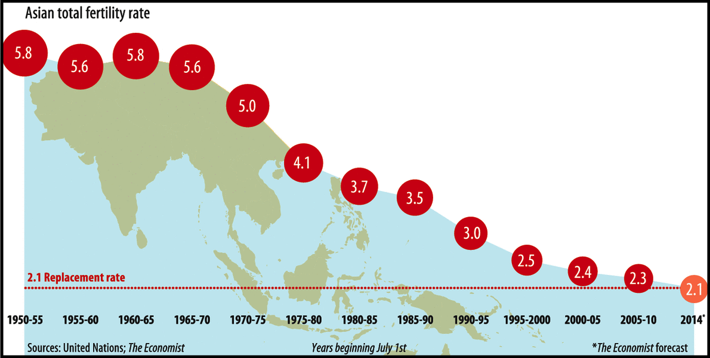

----------------- 

&nbsp;  

### Motivation

Fertility rates are a direct indicator of population growth within a given country or region. The global total fertility rate has been steadily declining, and is projected to [drop to 1.66 by the year 2100](https://www.thelancet.com/journals/lancet/article/PIIS0140-6736(20)30677-2/fulltext). Understanding how social and geopolitical events and  natural disasters potentially impact fertility is critical in understanding how population demographics change.

In recent history, Southeast Asian countries have experienced a unique combination of complex emergencies, shifts in educational access, and disease outbreaks. This analysis aims to explore changes in fertility in Southeast Asian countries over time, in relation to the aforementioned crises and socioeconomic shifts. 

&nbsp;  

### Site Framework

On this website, you will find explorations and analyses from data obtained through the [World Bank](https://datatopics.worldbank.org/education/), [ReliefWeb](https://reliefweb.int/disasters), and the  [Global Health Data Exchange](http://ghdx.healthdata.org/record/ihme-data/gbd-2019-fertility-estimates-1950-2019).

In the *exploratory analyses* tab, you will find plots describing changes in fertility indicators over time, education rates over time, and types of complex emergencies by country. 

In the *spatial patterns* tab, you will find maps detailing total fertility rates and secondary school enrollment for each country by decade. 

In the *linear models* tab, you will find a linear model describing the effects of education rates and complex emergencies on fertility indicators. 

You can find our written report [here](project_report.html). You can find the screencast of our project [here](https://www.youtube.com/watch?v=jx8xVy4DKI4&feature=youtu.be).

